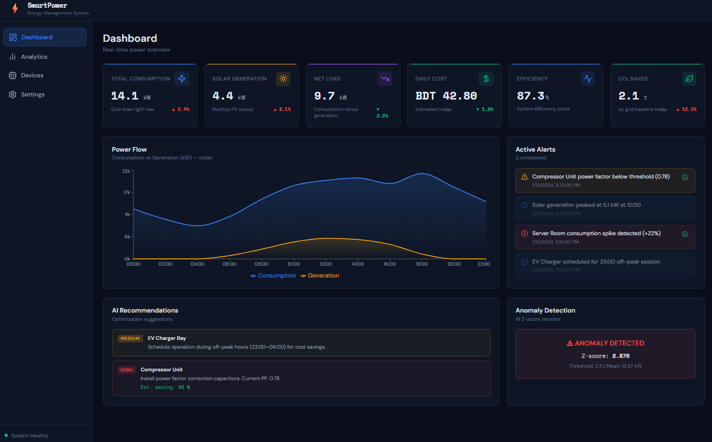

# SmartPower - Energy Management System

<p align="center">
  
</p>

<p align="center">
  <b>AI-Powered Energy Management and Optimization Platform</b>
</p>

<p align="center">
  Monitor • Analyze • Forecast • Optimize
</p>

---

## Overview

SmartPower is a full-stack real-time power monitoring dashboard with AI-powered forecasting, anomaly detection, live analytics, device monitoring, and optimization recommendations.

The platform helps homes, campuses, and facilities understand consumption, solar generation, net load, energy cost, efficiency, CO2 savings, and active alerts from one dashboard.

## Stack

| Layer | Technology |
| --- | --- |
| Frontend | React 18 + TypeScript + Vite |
| Styling | Custom CSS dark industrial theme |
| Charts | Recharts |
| Backend | Flask 3 + SQLAlchemy |
| AI | NumPy / scikit-learn style forecasting and Z-score detection |
| Database | SQLite, swappable via `DATABASE_URL` |

## Features

- Real-time energy monitoring
- Solar generation tracking
- Live net load analytics
- Energy cost estimation
- CO2 savings tracking
- AI energy forecasting
- Z-score anomaly detection
- Smart alerts system
- Device status monitoring
- Interactive dashboard charts
- Optimization recommendations
- Daily energy reports

## Project Structure

```text
smart-power-system/
├── src/
│   ├── client/          # React frontend
│   │   ├── components/  # Navbar, Sidebar, PowerCard, ChartCard, AlertBox
│   │   ├── pages/       # Dashboard, Analytics, Devices, Settings
│   │   ├── hooks/       # usePowerData polling hook
│   │   ├── services/    # Typed REST client
│   │   └── context/     # Global power state
│   ├── server/          # Flask backend
│   │   └── app/
│   │       ├── routes/
│   │       ├── controllers/
│   │       ├── services/
│   │       ├── models/
│   │       └── ai/
│   ├── shared/          # Shared TypeScript types
│   └── data/            # Mock seed data
├── assets/
├── public/
├── package.json
└── vite.config.ts
```


